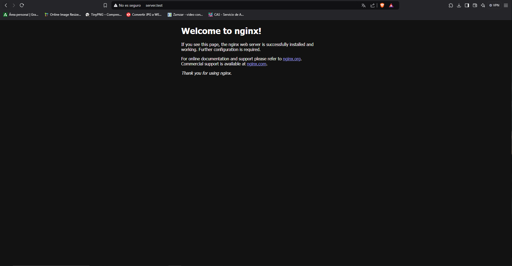
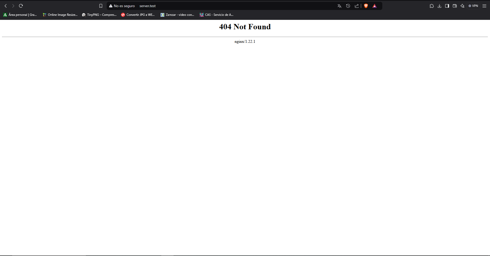
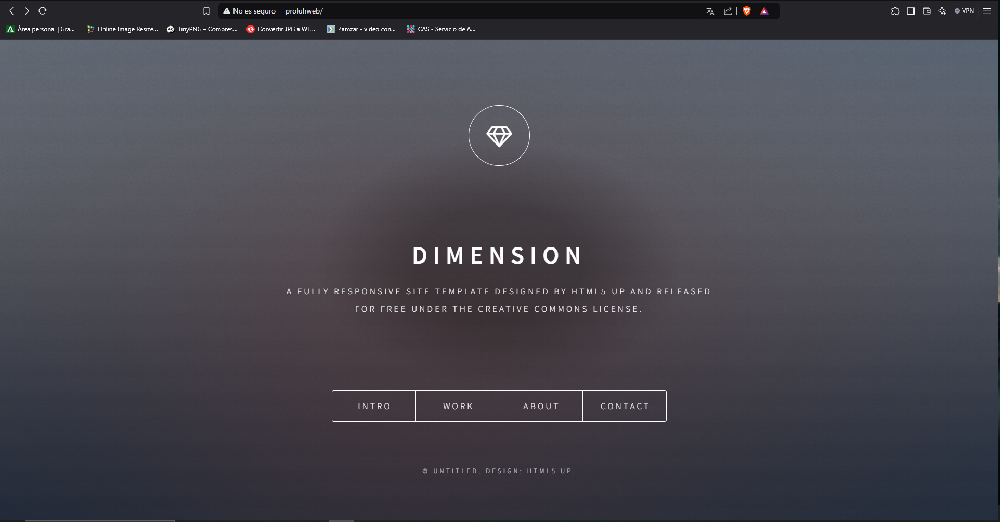
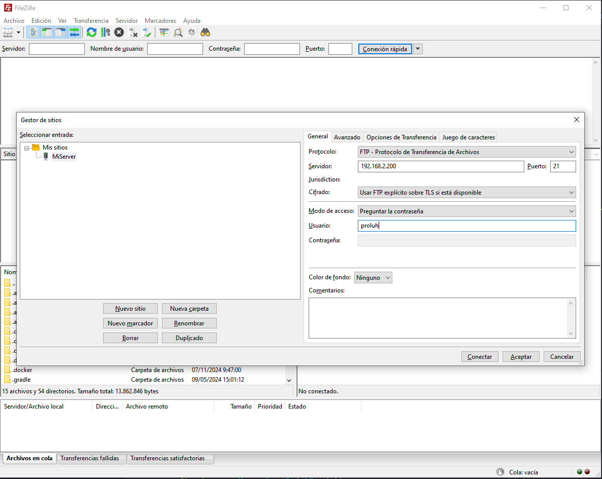
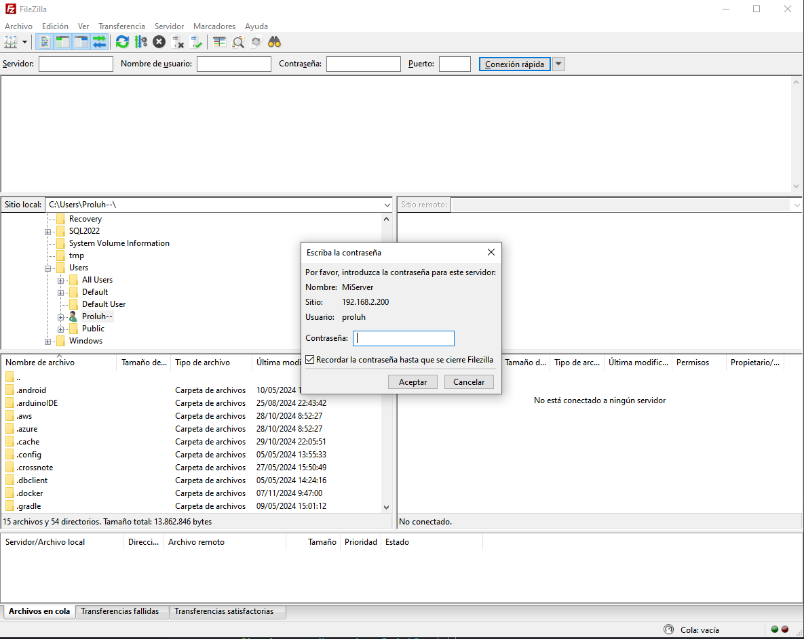
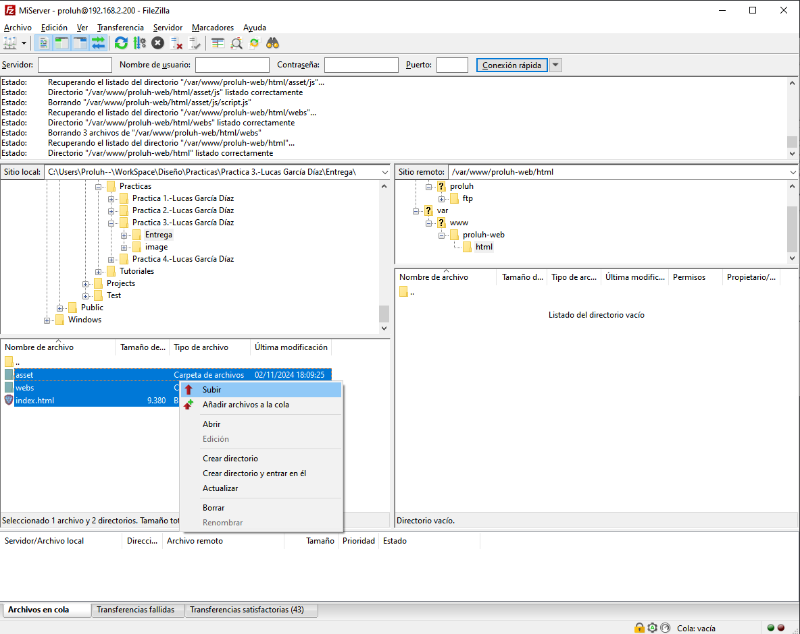
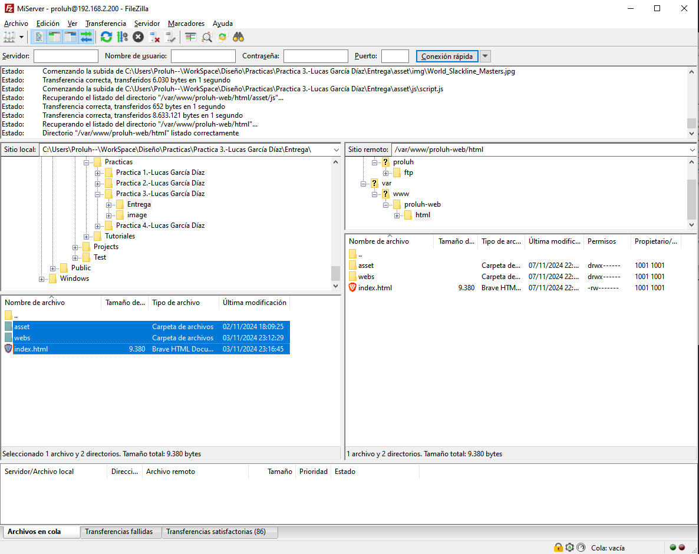
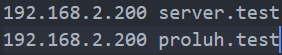

# Cuestiones

#### ¿Qué pasa si no hago el link simbólico entre sites-available y sites-enabled de mi sitio web?
En Nginx, la carpeta `sites-available` contiene las configuraciones de todos los sitios web que has configurado, mientras que `sites-enabled` es donde se almacenan los enlaces simbólicos (symlinks) a los archivos de configuración de los sitios habilitados.

Si no creas un enlace simbólico en `sites-enabled` a tu archivo de configuración en `sites-available`, Nginx no cargará la configuración del sitio cuando se reinicie.
Esto significa que el sitio web no se servirá el sitio web que hemos preparado y mostrará la pagina web por defecto `default`.

En  mi caso tengo `server.test` que se hace la redirección de nombre en **192.168.2.200**, este me respondera con la página por defecto, en vez con el sitio que tiene de **name_server** `server.test`:



#### ¿Qué pasa si no le doy los permisos adecuados a /var/www/nombre_web?
Si no le damos los permisos que en este caso sería los del usuario  `www-data` a la carpeta mencionada, nginx no podrá leer los archivos y nos respondera con un error **404 Not found**:



# Documentación de Configuración y Provisionamiento

Este proyecto está basado en el uso de **Vagrant**, un software para la creación y gestión de entornos virtualizados. La configuración de Vagrant, junto con varios scripts `shell`, automatiza el proceso de instalación de diversos servicios como **NGINX**, **vsftpd**, y la creación de sitios web usando **Git** y **FTP**. A continuación, se describe el proceso de configuración y los distintos scripts utilizados.

---

## Estructura del Proyecto

La estructura del proyecto es la siguiente:

```scss
                        .
                        ├── Vagrantfile
                        └── sh/
                            │
                            ├── nginx.sh
                            ├── ftp.sh
                            ├──primeraPagina(git).sh
                            └──segundaPagina(ftpd).sh
```


### Descripción de los Archivos

1. **Vagrantfile**: Archivo de configuración de Vagrant. Este archivo define la máquina virtual, sus configuraciones de red y las provisiones a ejecutar.
2. **nginx.sh**: Script para instalar y configurar el servidor web NGINX.
3. **ftp.sh**: Script para instalar y configurar el servidor FTP (vsftpd) y crear un usuario.
4. **primeraPagina(git).sh**: Script que instala Git, clona un repositorio web, configura el sitio web en NGINX y establece los permisos necesarios.
5. **segundaPagina(ftpd).sh**: Script para crear otro sitio web, configurarlo en NGINX y hacer la transferencia de archivos a través de FTP. También configura los permisos necesarios.

---
### Funcionamiento de las paginas WEB

Primer sitio web, transferencia de archivos con GIT.


Segunndo sitio web, transferencia de archivos con FTP.


---

### Transferencia manual de archivos con FTP

Conexión:


Contraseña:


Subida de archivos:



---
### Redireccion de nombres
En el archivo local de ordeandor dentro de `C:\Windows\System32\drivers\etc\hosts`


## Author

**Lucas García Díaz**  
Github: [github.com/lgardia1](https://github.com/lgardia1)  
Email: [lgardia026@ieszaidinvergeles.org](lgardia026@ieszaidinvergeles.org)